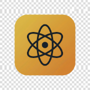
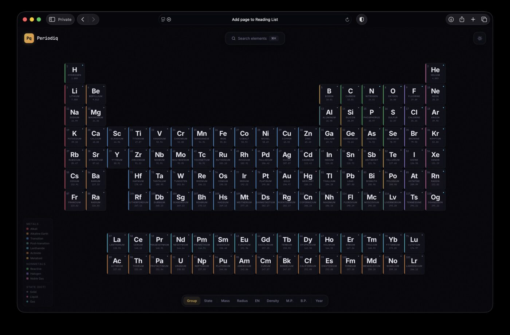
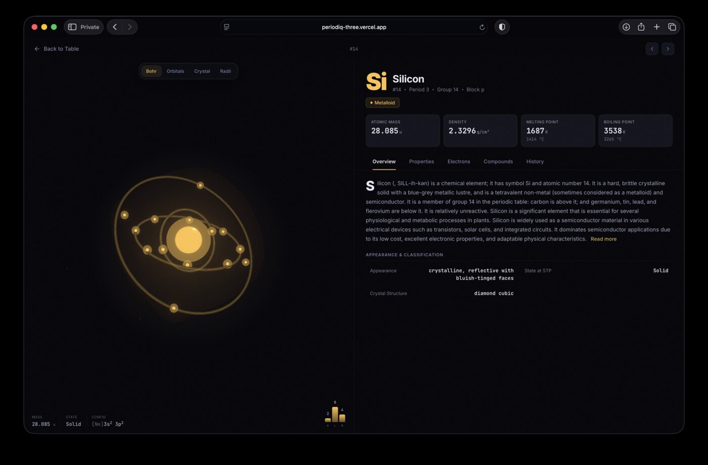
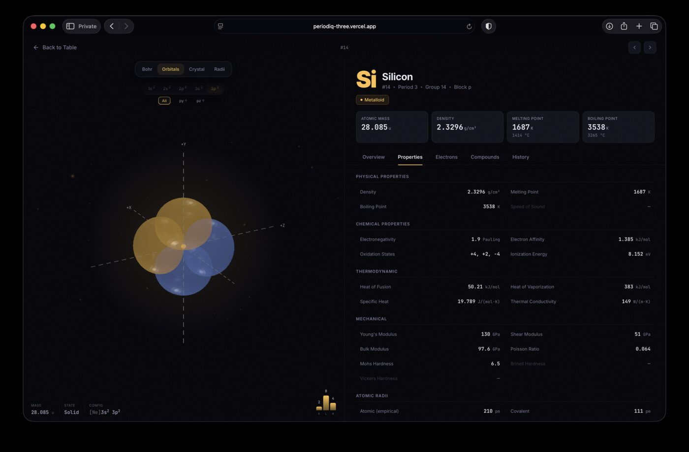
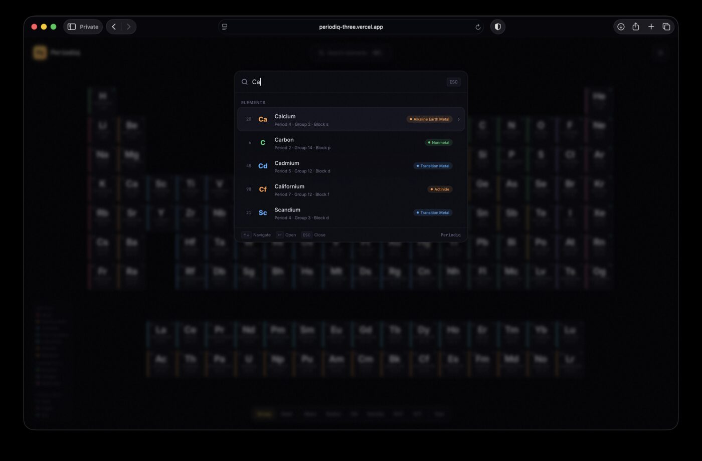

<h1 align="center">
  <br />
  
  <br />
  Periodiq
  <br />
</h1>

<p align="center">
  <strong>An interactive periodic table with 3D atom visualizations for all 118 elements.</strong>
</p>

<p align="center">
  <a href="https://periodiq-three.vercel.app"></a>
  
  
  
</p>

<br />

<p align="center">
  
</p>

<br />

## Why Periodiq?

Search "periodic table" and the top results are functional but stuck in 2010. Dense tables, flat colors, ad-heavy layouts. Chemistry deserves better.

Periodiq treats the periodic table as something worth exploring, not just referencing. Elements have presence. Metals shimmer with a light sweep. Gases emit floating particles. Radioactive elements pulse. The entire table transforms when you switch between property views, and elements change phase in real-time as you drag the temperature from 0K to 6000K.

Click any element and you're looking at a rotating 3D Bohr model, switching to real electron orbital shapes computed from spherical harmonics, inspecting crystal unit cells, or comparing atomic radii as nested translucent spheres.

<br />

## Explore Elements

Every element has a dedicated detail page with four 3D visualization modes and five data tabs.

<p align="center">
  
</p>
<p align="center"><em><sub>Silicon — Bohr model with animated electron shells, bloom glow, and sparkle particles</sub></em></p>

<br />

### Visualization Modes

| | |
|---|---|
| **Bohr Model** | Nucleus with orbiting electrons on tilted rings. Shell count matches real electron configuration. Outer shells orbit slower than inner ones. |
| **Electron Orbitals** | Isosurface shapes generated from real spherical harmonic functions Y(l,m). Positive and negative wavefunction phases shown in complementary colors. Subshell and individual orbital selection (dxy, dz², dx²-y², etc). |
| **Crystal Structure** | BCC, FCC, HCP, and diamond cubic unit cells with atom positions, nearest-neighbor bonds, and wireframe edges. Corner atoms rendered at lower opacity to show unit cell sharing. |
| **Atomic Radii** | Three concentric spheres for covalent, atomic, and van der Waals radii. Equator ring lines and in-scene labels for size reference. |

<br />

<p align="center">
  
</p>
<p align="center"><em><sub>Silicon — 3p² orbital isosurfaces from spherical harmonics, with the Properties tab showing physical and thermodynamic data</sub></em></p>

<br />

### Element Data

Each element carries approximately 100 data fields aggregated from PubChem and Wikipedia, organized across five tabs:

**Overview** gives you the element summary, appearance, crystal structure, and identifiers. Summaries are expandable for deeper reading.

**Properties** covers physical, chemical, thermodynamic, mechanical, and electromagnetic data. Sections with no data for that element are hidden automatically.

**Electrons** shows the electron configuration with noble gas core labels (e.g., "Argon core + valence"), shell fill ratios (14/18 for Iron's M shell), and an ionization energy bar chart.

**Compounds** lists curated compounds with formula, name, and real-world applications. 381 compounds across 99 elements. A link to PubChem opens further exploration.

**History** starts with the etymology of the element name (hand-written for all 118) followed by a discovery timeline and quick reference facts.

<br />

## Search

Press `⌘K` from anywhere in the app to open the command palette. Search by name, symbol, or atomic number with ranked fuzzy matching. Filter by category to browse element families. Fully keyboard-navigable.

<p align="center">
  
</p>
<p align="center"><em><sub>Searching "Ca" returns Calcium, Carbon, Cadmium, Californium, and Scandium, ranked by relevance</sub></em></p>

<br />

## The Table

Nine property coloring modes let you see the periodic table through different lenses:

| Mode | What it reveals |
|------|----------------|
| **Group** | Chemical families: alkali metals, transition metals, noble gases, halogens, lanthanides, actinides |
| **State** | Solid, liquid, or gas at the current temperature (syncs with the temperature slider) |
| **Mass** | Atomic mass gradient from hydrogen (1u) to oganesson (295u) |
| **Radius** | Atomic radius from smallest to largest |
| **Electronegativity** | Pauling scale from francium (0.7) to fluorine (4.0) |
| **Density** | From hydrogen gas to osmium |
| **Melting Point** | From helium (0.95K) to tungsten (3695K) |
| **Boiling Point** | Full range across all elements |
| **Year** | Discovery timeline from 1669 to 2010 |

The temperature slider ranges from 0K to 6000K. Helium correctly remains liquid near absolute zero (it never solidifies at 1 atm). Phase changes use accurate melting and boiling point data for every element.

<br />

## Data

Each element carries approximately 100 data fields aggregated from public scientific databases, validated for type correctness and sane ranges across all 118 elements.

Two additional datasets were hand-curated:

**381 compounds** across 99 elements. Each compound includes the formula (with Unicode subscripts), IUPAC name, and a description of real-world applications. Superheavy elements (Rf through Og) have no stable compounds and are correctly left empty.

**118 etymologies** covering the linguistic origin of every element name. From Greek roots ("hydrogen" = water-former) to place names ("ytterbium" from Ytterby, Sweden) to people ("oganesson" from Yuri Oganessian, the only living person with a named element).

<br />

## Built With

Next.js 16 · React 19 · TypeScript · Tailwind v4 · Zustand · React Three Fiber · Vitest

<br />

## Running Locally

```bash
git clone https://github.com/saidutt46/Periodiq.git
cd Periodiq
npm install
npm run dev        # starts at http://localhost:3000
```

Requires Node.js 20+.

Production build generates 118 static element pages via SSG:

```bash
npm run build
npm run test       # unit tests (vitest)
```

<br />

## Contributing

Periodiq is open to contributions. Areas where help is welcome:

- **Responsive layout** for mobile and tablet
- **Emission spectrum visualization** (requires real NIST spectral line data)
- **Element summaries** rewritten in an original voice (currently sourced from Wikipedia)
- **Abundance data** from USGS/NOAA sources
- **Accessibility** improvements and screen reader testing

<br />

## License

[MIT](LICENSE)
